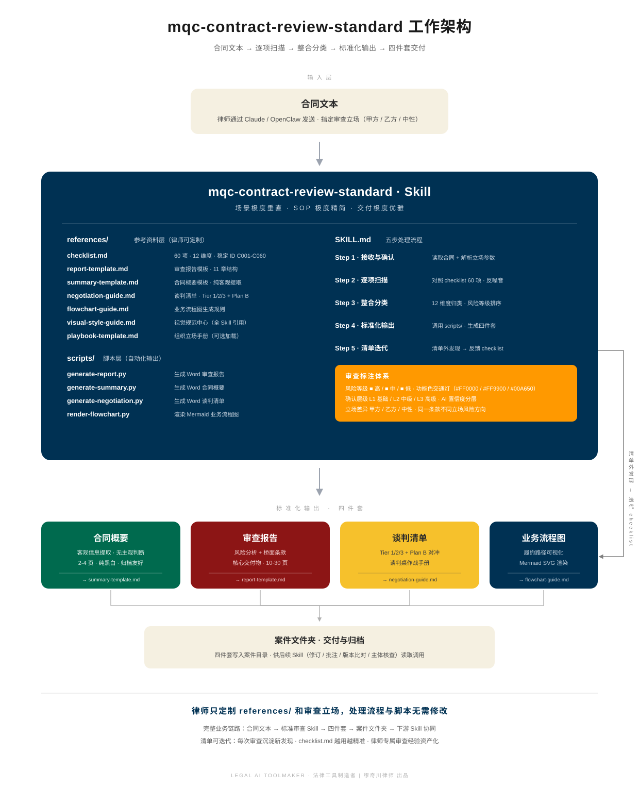

# mqc-contract-review-standard

## 标准合同审查 Skill

> **LEGAL AI TOOLMAKER · 法律工具制造者 | 缪奇川律师 出品**
>
> 场景极度垂直 · SOP 极度精简 · 交付极度优雅

---

## 一、这是什么

**mqc-contract-review-standard** 是一个可加载进 Claude 的**法律工作 Skill**——不是一条提示词，不是一套模板，是一个完整的工作系统。

给它一份合同和你的审查立场（甲方 / 乙方 / 中性），它会：

- 对照 **60 项 12 维度**的标准化审查清单逐项扫描
- 以 **L1 / L2 / L3 三档置信度**标注每条发现（律师决定哪些直接采信、哪些人工复核）
- 生成出版级的**八件套交付物**：
  - **分析四件**：合同概要 · 审查报告 · 谈判优先级清单 · 业务流程图
  - **文本四件**（v2.0 新增）：批注版 · 修订版 · 修订批注版 · 清洁版——在原合同 docx 上直接施工
- 所有输出以**使用者本人**为经办律师署名（批注作者、修订作者、封面署名均参数化）
- 把审查中发现的"清单外问题"自动归档，推动清单的持续迭代

**与市面上其他合同审查工具的差异**:

| 维度 | 市面主流做法 | 本 Skill 做法 |
| --- | --- | --- |
| 审查清单 | 硬编码在提示词中,不可迭代 | **独立文件 checklist.md,律师可迭代可定制** |
| 判断标准 | 质性描述("违约金过高") | **数字化阈值**(超过合同金额 30% + 行业分化阈值) |
| 立场差异 | 单一视角 | **每项标注甲方立场 / 乙方立场差异** |
| 反噪音机制 | 无 | **典型不触发反例**(告诉 AI 什么情况不要报警) |
| 置信度标注 | 无 | **L1 / L2 / L3 三档**,明确哪些必须人工复核 |
| 规则来源 | 混同 | **三类来源分开**(标准清单 / Playbook 覆盖 / 清单外发现)  |
| 精准审查 | 一次扫描 | **关键条款独立复扫一次**(标记 [精准审查]) |
| 修改建议呈现 | 堆叠段落 | **三列对照表**(原文 \| 建议·红字标注改动字 \| 理由) |
| 修改落地 | 只出报告,修改靠律师手工 | **文本四件**(批注版 / 修订版 / 修订批注版 / 清洁版),修订可在 Word 中逐条接受/拒绝 |
| 署名 | 输出物署工具作者名 | **经办律师署名参数化**,批注与修订作者都是使用者本人 |
| 输出格式 | 纯文本 / 简单 Markdown | **Python 脚本生成出版级 Word 文档**(Word 导航窗格可用) |

---

## 二、快速体验(5 分钟)

**想立刻看到这个 Skill 能做什么?** 直接打开 `examples/demo-case/` 目录的五件交付物:

| 文件 | 角色 |
| --- | --- |
| `01-原合同-脱敏版.docx` | 一份虚构的技术服务合同,含 7 个精心设计的"坑" |
| `02-合同概要-输出样例.docx` | 本 Skill 生成的合同概要(纯客观信息提取,11 章结构) |
| `03-审查报告-输出样例.docx` | 本 Skill 生成的审查报告(11 章 · 三列对照表 · 红字标注修订 · 规则来源分类) |
| `04-谈判优先级清单-输出样例.docx` | 本 Skill 生成的谈判清单(Tier 1/2/3 · Plan B · 交换矩阵) |
| `05-业务流程图.svg` | 本 Skill 生成的业务流程图(合同履约全流程 · 7 类节点配色 · **SVG 矢量图,不是 docx**) |
| `技术服务合同_批注版.docx` | **v2.0 新增** · 原合同 + 逐条 Word 批注(正文一字不动) |
| `技术服务合同_修订版.docx` | **v2.0 新增** · 修订模式修改(Word 中可逐条接受/拒绝),无批注 |
| `技术服务合同_修订批注版.docx` | **v2.0 新增** · 修订 + 批注二合一(看到改动,旁边就是理由) |
| `技术服务合同_清洁版.docx` | **v2.0 新增** · 按审查结果直接改完的定稿(含补入的不可抗力条款) |
| `README.md` | 详细引导(三个阅读场景:快速体验 / 律师实操 / 二次开发) |

**推荐 5 分钟快速路径**:
1. 打开 `01-原合同-脱敏版.docx` 第 2 页,找到 **3.1 条**:看"小写 86 万、大写 76 万"的错位
2. 打开 `03-审查报告-输出样例.docx` 看 **风险 02**:AI 如何识别、分析、给出桥面条款修改建议(**注意红色标注的改动字**)
3. 打开 `04-谈判优先级清单-输出样例.docx` 看 **Tier 1-02**:同一个问题在谈判视角下的处理方式

**在 Word 中使用导航窗格**:打开任何一份输出 docx 后,点击"视图 → 导航窗格",可以看到完整的大纲结构,一级/二级标题全部可跳转。

**一个问题,三种视角**——分析四件回答"有什么问题、怎么谈";再打开修订批注版,看同一个问题**在合同原文上被怎样改掉**——这就是八件套协同的价值。

---

## 三、工作架构



架构一图说清：

- **输入层**：合同文本（Word / PDF）+ 审查立场参数
- **主 Skill 块**：左侧 references/ 是律师可定制的参考资料层（清单、模板、规范），右侧 SKILL.md 是五步处理流程，下方 scripts/ 是自动化脚本
- **输出层**：八件套标准化交付物(分析四件 + 文本四件)
- **交付层**：写入案件文件夹，供后续 skill（修订 / 批注 / 版本比对 / 主体核查）协同调用
- **迭代回路**：清单外发现反馈给 checklist.md，清单越用越精准

**核心洞察**：律师只需定制 `references/` 中的参考资料和审查立场，处理流程和 Python 脚本无需修改即可工作。

---

## 四、三大设计原则

这三条原则贯穿 Skill 的每一个文件、每一个输出，是判断任何设计决策的最高准则。

### 原则一 · 场景极度垂直

本 Skill 只做一件事：**中国大陆商事合同的标准化审查**。

不做合同起草，不做主体工商核查（见 mqc-entity-verify），不做脱敏处理（见 mqc-doc-sanitize）。"不做什么"和"做什么"同样重要。（批注版与修订版输出原属独立 skill 规划，自 v2.0 起已并入本 Skill 的文本四件。）

### 原则二 · SOP 极度精简

审查清单 60 项 × 每项 7 字段 × 3 档置信度 × 3 类立场——所有判断环节都有明确规范、数字化标准、可复现结果。**同一份合同、同一个立场，两次审查结果应高度一致**。

### 原则三 · 交付极度优雅

法律工具的输出物不只要准确，还要美观、有设计感、符合现代商务审美。Word 报告的字体、表格、颜色、流程图、SVG 全部按出版级标准制作——**交付物看起来像 McKinsey 的咨询报告，不像学生作业**。

---

## 五、文件结构

```
mqc-contract-review-standard/
│
├── SKILL.md                              ← 你正在读的文件
├── AUTHOR.md                             ← 作者名片
├── LICENSE                               ← MIT 协议
│
├── references/                           ← 参考资料层（律师可定制）
│   ├── checklist.md                      ← 审查清单 60 项 12 维度（灵魂）
│   ├── report-template.md                ← 审查报告模板（11 章结构）
│   ├── summary-template.md               ← 合同概要模板（10 节结构）
│   ├── negotiation-guide.md              ← 谈判清单规则（Tier 1/2/3 + Plan B）
│   ├── modify-guide.md                   ← 合同修改文件规则（文本四件 · v2.0 新增）
│   ├── flowchart-guide.md                ← 业务流程图生成规则
│   ├── visual-style-guide.md             ← 视觉规范中心（所有可视化元素的基准）
│   └── playbook-template.md              ← 组织立场手册模板（可选加载）
│
├── scripts/                              ← 自动化脚本层
│   ├── _common.py                        ← 共享基础（色板 / 字体 / 表格样板）
│   ├── generate-summary.py               ← 生成 Word 合同概要
│   ├── generate-report.py                ← 生成 Word 审查报告
│   ├── generate-negotiation.py           ← 生成 Word 谈判优先级清单
│   ├── generate-modified.py              ← 生成文本四件(批注/修订/修订批注/清洁 · v2.0 新增)
│   ├── generate-flowchart.py             ← 生成 SVG 精美业务流程图(方案 A · 默认)
│   └── render-flowchart.py               ← 渲染 Mermaid 业务流程图 PNG(方案 B · 降级)
│
└── examples/                             ← 视觉标杆 + 示例案件
    ├── 01-architecture-sample.svg        ← 架构图基准
    ├── 02-flowchart-sample.svg           ← 业务流程图基准(SVG 精美版标杆)
    └── demo-case/                        ← 脱敏示例案件(完整输入-输出闭环)
        ├── 01-原合同-脱敏版.docx         ← 含 7 个精心设计"坑"的示例合同
        ├── 02-合同概要-输出样例.docx     ← generate-summary.py 实际输出
        ├── 03-审查报告-输出样例.docx     ← generate-report.py 实际输出
        ├── 04-谈判优先级清单-输出样例.docx ← generate-negotiation.py 实际输出
        ├── 05-业务流程图.svg             ← generate-flowchart.py 实际输出(SVG 精美版)
        ├── 技术服务合同_批注版.docx       ← generate-modified.py 实际输出(annotate)
        ├── 技术服务合同_修订版.docx       ← generate-modified.py 实际输出(revise)
        ├── 技术服务合同_修订批注版.docx   ← generate-modified.py 实际输出(both)
        ├── 技术服务合同_清洁版.docx       ← generate-modified.py 实际输出(clean)
        ├── README.md                     ← 使用说明(三场景引导)
        └── data/                         ← 输入数据(可参考其结构)
            ├── summary-data.json
            ├── report-data.json          ← 核心字段:rule_source · is_precise_review
            ├── negotiation-data.json     ← 核心字段:rule_source · **改动字**红标
            ├── flowchart-data.json       ← generate-flowchart.py 的输入(节点结构化数据)
            └── 业务流程图.mmd            ← render-flowchart.py 的 Mermaid 源码(降级方案)
```

---

## 六、五步处理流程（Claude 的执行指令）

**本节是给 Claude 模型的指令，人类读者可略读**。当用户加载本 Skill 并上传合同时，Claude 应严格按以下五步执行。

### Step 1 · 接收与确认

读取用户上传的合同文件（支持 `.docx` / `.pdf`）。

**向用户确认以下参数**：
- **审查立场**：甲方 / 乙方 / 中性（必选，影响所有立场差异条款的判断方向）
- **经办律师姓名 + 律所名称**（**必答** · v2.0 新增）：写入所有输出文档——报告封面"经办律师"、批注版的批注作者、修订版的修订作者。**输出物署的是使用者的名字，不是工具作者的名字**
- **合同类型**：买卖 / 服务 / 技术开发 / 股权 / 其他（可选，影响检查项优先级）
- **是否启用 playbook**：如用户提供了组织立场手册（如"本所绝不接受无限连带责任"），加载 `references/playbook-template.md` 规则
- **品牌落款**（可选）：封面底部品牌行默认为"LEGAL AI TOOLMAKER · 法律工具制造者 | 缪奇川律师 出品"；用户可在数据 JSON 中用 `brand_line` 字段整体替换，设为空字符串 `""` 则不显示

**边界条件处理**（遇到以下情形必须停下并向用户确认）：
- 合同为扫描版 PDF（无可提取文字层）
- 合同文件加密或损坏
- 合同超过 100 页（提示超长处理策略）
- 合同涉及港澳台或境外法律（提示本 Skill 默认中国大陆法）

### Step 2 · 逐项扫描

加载 `references/checklist.md`,按 **C001 至 C060** 顺序对合同逐项判断:

对每一项检查项,AI 应产出:
- **是否触发**:✓ 正常 / ■ 低风险 / ■ 中风险 / ■ 高风险
- **确认层级**:继承清单中的 L1 / L2 / L3 标注
- **规则来源**:标注三类之一
  - `checklist` · 命中标准清单 C001-C060
  - `playbook` · 命中组织立场手册(覆盖了 checklist 的默认判断)
  - `extra` · 清单外发现(不属于前两类,由 AI 自主识别的风险)
- **触发原文**:合同中触发此判断的原文摘录(不超过两行)
- **修改建议**:参照 checklist 中的建议,输出可直接替换的具体条款文字(桥面条款)
- **修改建议字红标**:在 `suggestion_revised` 字段里,用 `**...**` 包裹的文字会在输出的 Word 中显示为红色 `#EE0000`,律师一眼能看到改了什么字

**反噪音机制(重要)**:
- 对每一项,先读"典型不触发"反例,判断当前条款是否在反例范围内
- 如在反例范围内 → 标注为 ✓ 正常,**不生成发现条目**
- 只报告清单命中项 + 确实存在的缺失条款
- **不主动"建议补充 XX 条款"**,除非清单里有对应检查项
- **不输出"建议完善 XX 机制"**等方向性废话

### Step 2.5 · 精准审查复核

对于**特别重要的关键条款**,Step 2 扫描完成后独立再扫一次,对抗大模型的注意力涣散问题:

**精准审查范围**:
- 所有 L3 级别的检查项(如无限连带责任、违约金合理性、数据合规性)
- Tier 1 谈判优先级项
- 合同核心商业条款(金额、期限、关键义务)

**实现方式**:对每条这样的风险,在 JSON 中标注 `"is_precise_review": true`,在输出的 Word 里会显示 `[精准审查]` 文字标签(**不使用 emoji 符号**,保持律师文件的专业感)。

**效果**:汇总表里这些项也会带 `[精准]` 前缀,便于律师一眼识别哪些已经经过独立复核。

### Step 3 · 整合分类

扫描完成后,整合所有发现:

- **按 12 维度归类**(主体资格 / 合同标的 / 价款支付 / 权利义务 / 违约责任 / 知识产权 / 保密 / 争议解决 / 合同期限 / 不可抗力 / 送达签署 / 其他)
- **按风险等级排序**(■ 高 → ■ 中 → ■ 低)
- **按规则来源分类**:标注每条发现属于 标准清单 / Playbook 覆盖 / 清单外发现 的哪一类
- **生成稳定 ID 索引**(每个发现对应 checklist 的 C001-C060 中某一项)
- **识别清单外发现**(如有确实值得报告但清单未覆盖的问题,归入"清单外发现"章节 · 对应 `rule_source: extra`)

### Step 4 · 标准化输出(调用 scripts/)

按以下顺序调用脚本,生成八件套(分析四件 + 文本四件):

| 顺序 | 脚本 | 输出 | 读取 reference |
| --- | --- | --- | --- |
| 1 | `scripts/generate-summary.py` | `{合同名}_合同概要.docx` | `summary-template.md` |
| 2 | `scripts/generate-report.py` | `{合同名}_审查报告.docx` | `report-template.md` + `checklist.md` |
| 3 | `scripts/generate-negotiation.py` | `{合同名}_谈判优先级清单.docx` | `negotiation-guide.md` |
| 4a | `scripts/generate-flowchart.py` **(方案 A · 默认)** | `{合同名}_业务流程图.svg`(精美版) | `flowchart-guide.md` |
| 4b | `scripts/render-flowchart.py` (方案 B · 降级) | `{合同名}_业务流程图.png`(Mermaid 渲染) | `flowchart-guide.md` |
| 5 | `scripts/generate-modified.py --mode all` **(v2.0 新增)** | `{合同名}_批注版.docx` · `{合同名}_修订版.docx` · `{合同名}_修订批注版.docx` · `{合同名}_清洁版.docx` | `modify-guide.md` |

#### 文本四件的执行要点(v2.0 新增 · Claude 必读)

```bash
# Step 5 · 复用 report-data.json,在原合同 docx 上一次生成四件
python3 scripts/generate-modified.py \
    --contract "<原合同>.docx" \
    --data "<输出目录>/report-data.json" \
    --mode all \
    --output-dir "<输出目录>" \
    --contract-name "{合同名}"
```

- **数据零新增**:文本四件完全复用 report-data.json,前提是其中的 `original_text` / `suggestion_original` **必须是合同原文的逐字引用**(逐字引用铁律见 `modify-guide.md`)
- **署名**:批注作者与修订作者自动取 `data["lawyer"]`(Step 1 收集的经办律师)
- **定位失败必须处理**:脚本输出"定位失败清单"时,回到原合同复制逐字原文修正 JSON 后重跑;模糊定位条目须在交付说明中列出提示人工核对
- **清洁版边界**:交付时必须提示——清洁版是单方修改稿,对方确认前不得用于签署

#### 🚨 业务流程图的严格要求(Claude 必读)

**业务流程图不是 Word 文档,输出扩展名绝对不能是 .docx。**

正确做法(方案 A · 默认 · 强烈推荐):

```bash
# Step 4a · AI 先输出节点 JSON 到临时文件,然后调用脚本
python3 scripts/generate-flowchart.py \
    --data "<输出目录>/flowchart-data.json" \
    --output "<输出目录>/{合同名}_业务流程图.svg"
```

**关键约束**:
- `--output` 参数**必须且只能**用 **`.svg`** 扩展名(或方案 B 的 `.png`)
- **禁止**使用 `.docx` / `.doc` / `.pdf` 扩展名(脚本会直接报错)
- **禁止**让 Claude 自己用 python-docx / create_file 等方式"创造"流程图文件
- **禁止**试图把 SVG 内容嵌入 Word 文档

**如果 Claude 违反以上约束,会产生"有内容但 Word 打不开"的损坏文件——这是已知的严重 bug 场景。**

#### 业务流程图双方案使用原则

- **默认使用方案 A**:AI 识别合同业务节点 → 输出 `flowchart-data.json` → `generate-flowchart.py` 按铁律渲染精美 SVG
- **降级到方案 B**:批量审查、无法深度推理、或节点极简时使用 Mermaid 方案

**输出位置**:用户指定的输出目录(默认 `<用户指定路径>/<合同名>_审查_YYYYMMDD/`)。

**输出文档的视觉规范(适用于分析件中的 3 份 docx;文本四件保持原合同版式)**:
- 一级/二级标题应用 Word 内建 `Heading 1` / `Heading 2` 样式(导航窗格可见)
- 字体严格对齐图书《参考格式》:16/14/12pt · 1.5 倍行距 · 首行缩进 0.85cm · 两端对齐
- 封面采用包豪斯风格 · 浅蓝 `#1387C0` 单色 · 单外层表格保证单页
- 风险卡片采用三列对照表(原文 \| 建议·红字标注 \| 理由)
- 全局黑字,仅风险 ■ 符号和修改建议改动字保留功能色

### Step 5 · 清单迭代建议

八件套生成后,向用户报告:

- 审查摘要(■ 高 X 处 · ■ 中 Y 处 · ■ 低 Z 处 · 清单外 N 处)
- 规则来源分布(标准清单 A 处 · Playbook 覆盖 B 处 · 清单外发现 C 处)
- 文本四件处理结果(精确定位 X 处 · 模糊定位 Y 处需人工核对 · 缺失条款补入情况)
- 如有清单外发现,提示用户可考虑将其补入 `references/checklist.md`,供未来同类合同复用
- 输出文件清单(八件套路径)

---

## 七、审查标注体系

本 Skill 使用**三套独立正交的标注系统**，不可混用。

### 7.1 风险等级（功能色 · 交通灯）

传达"合同问题的严重性"。

| 标注 | 色值 | 含义 |
| --- | --- | --- |
| ■ 高风险 | `#FF0000` | 涉及合同效力或重大利益，不改则不应签约 |
| ■ 中风险 | `#FF9900` | 偏离行业惯例或对己方不利，应争取修改 |
| ■ 低风险 | `#00A650` | 规范性瑕疵或略微不利，可作让步筹码 |
| ✓ 正常 | 黑 | 符合标准，无需修改 |

> 符号规范:Word 输出中风险等级一律使用 **■ 方块(功能色)+ 文字标签**,不使用 emoji(见 `visual-style-guide.md`)。

### 7.2 确认层级（AI 置信度分层）

传达"AI 判断的可靠程度"，帮助律师决定复核强度。

| 层级 | 含义 | 处理建议 |
| --- | --- | --- |
| **L1 基础级** | 文本表面可见的问题（大小写金额不符、错别字、明显的数字错误） | AI 确定性高，可直接采信 |
| **L2 中级** | 需要交叉阅读或逻辑推理才能发现的问题（条款前后矛盾、程序性陷阱） | 建议人工复核 |
| **L3 高级** | 需要结合法规 / 司法实践 / 行业惯例判断的问题（违约金合理性、数据合规） | 必须人工复核 |

### 7.3 立场差异

传达"同一条款在不同立场下的风险方向"。

- **甲方立场**：按甲方（通常是委托方 / 付款方）的视角判断风险
- **乙方立场**：按乙方（通常是履约方 / 收款方）的视角判断风险
- **中性**：条款无立场差异，甲乙方风险方向一致

---

## 八、跨 Skill 导航

本 Skill 是 **mqc-legal-skills** 系列的一部分。以下是不同需求对应的 skill：

| 需求场景 | 对应 Skill | 状态 |
| --- | --- | --- |
| 标准审查（本 skill） | mqc-contract-review-standard | ✓ v2.0 |
| 快速判断合同是否可签（3 分钟对话式） | mqc-contract-review-quick | ✓ 已发布 |
| 批量审查多份合同 | mqc-contract-review-batch | ✓ 已发布 |
| 一键应用修改建议生成修订版 | ~~mqc-contract-review-to-modify~~ | **已并入本 skill v2.0**（修订版 / 清洁版） |
| 生成批注版合同（在原文加批注） | ~~mqc-contract-annotate~~ | **已并入本 skill v2.0**（批注版 / 修订批注版） |
| 合同版本差异对比 | mqc-contract-template-review | 规划中 |
| 合同主体工商资质核查 | mqc-entity-verify | 规划中 |
| 合同文件脱敏处理 | mqc-doc-sanitize | 规划中 |

**数据总线约定**：所有 mqc- 系列 skill 统一读写案件文件夹，实现跨 skill 协同。案件文件夹标准结构见 mqc-legal-skills 主仓库 `docs/architecture.md`（规划中）。

---

## 九、references/ 版本对照表

Skill 的八个参考文件各有独立版本号。版本演进相互独立。

| 文件 | 当前版本 | 作用 | 依赖关系 |
| --- | --- | --- | --- |
| `checklist.md` | **v1.0.1** | 审查清单(灵魂文件) | 被 report、negotiation、modify 引用 |
| `report-template.md` | **v1.1.0** | 审查报告模板(三列对照表 + 规则来源) | 引用 checklist 稳定 ID |
| `summary-template.md` | **v1.0.0** | 合同概要模板(11 章 · 全黑字) | 独立 |
| `negotiation-guide.md` | **v1.0.1** | 谈判清单规则(Tier + Plan B + 红字标注) | 引用 report 的风险发现 |
| `modify-guide.md` | **v1.0.0** | 合同修改文件规则(文本四件 · v2.0 新增) | 复用 report-data.json;引用 checklist / visual-style-guide |
| `flowchart-guide.md` | **v1.0.1** | 业务流程图规则(SVG 默认 / Mermaid 降级) | 引用 visual-style-guide |
| `visual-style-guide.md` | **v1.0.1** | 视觉规范中心(黑字全局 + 修订红 + 包豪斯封面) | 所有可视化文件引用此文件 |
| `playbook-template.md` | **v1.0.1** | 组织立场手册模板 | 可选加载 |

**整个 Skill 当前版本为 v2.0.0**。任何单个文件升级后会同步刷新 Skill 的语义版本(breaking change 触发主版本号、新特性触发次版本号、修订触发补丁号)。

---

## 十、scripts/ 脚本索引

| 脚本 | 版本 | 输入 | 输出 | 关键特征 |
| --- | --- | --- | --- | --- |
| `_common.py` | v1.1.0 | —(被其他脚本 import) | — | 三列对照表 / 正红 #EE0000 / enforce_cell_formatting / 品牌行可配置(get_brand_line) |
| `generate-summary.py` | v1.0.1 | 合同扫描结果 JSON + summary-template.md | `.docx` | 11 章结构 / 纯黑字 / 包豪斯封面 / Heading 样式 |
| `generate-report.py` | v1.1.0 | 扫描结果 + report-template.md + checklist.md | `.docx` | 11 章结构 / 三列对照表 / 红字标注 / 规则来源 / 精准审查 / 经办律师署名参数化 |
| `generate-negotiation.py` | v1.0.1 | 审查报告风险发现 + negotiation-guide.md | `.docx` | Tier 1/2/3 / Plan B 红字 / 交换矩阵 |
| **`generate-modified.py`** | **v1.0.0** | **原合同 docx + report-data.json** | **4 × `.docx`(批注/修订/修订批注/清洁)** | **v2.0 新增** · 批注/修订作者=经办律师 · OOXML w:ins/w:del · 缺失条款自动补入 · 定位三层防御 |
| **`generate-flowchart.py`** | **v1.0.0** | **节点结构化 JSON (flowchart-data.json)** | **`.svg`(精美版)** | **方案 A 默认** · 按铁律渲染 · 对标 02-flowchart-sample.svg · 菱形小圆角 · 回路直线+转角圆角 |
| `render-flowchart.py` | v1.0.1 | 合同履约路径 SVG 或 Mermaid 源码 | `.svg` / `.png` | 双方案分派 · SVG 直通 / Mermaid 渲染 · Mermaid 色板与方案 A 对齐 |

**依赖环境**:
- Python 3.10+
- 依赖包:`python-docx >= 1.2.0`(Word 生成;批注 API 需 1.2.0+)
- Mermaid CLI(可选,仅 render-flowchart 的 Mermaid 渲染模式需要):`npm install -g @mermaid-js/mermaid-cli`
- `generate-flowchart.py` 无外部依赖(纯 Python 标准库)

**视觉规范自动继承**:所有脚本通过 `_common.py` 共享同一套色板、字体、表格样式——修改规范只需改一处。

---

## 十一、错误处理与边界

### 11.1 应当停下并向用户确认的情形

- 合同文件为扫描版 PDF（无可提取文字层）→ 建议用户使用 OCR 处理后再审查
- 合同文件加密 → 请用户提供解密版本
- 合同超过 100 页 → 提示"超长合同建议拆分为主协议 + 附件分别审查"
- 审查立场未明确 → 不默认立场，必须追问
- 合同涉及港澳台 / 境外法律 → 明确告知本 Skill 默认中国大陆法，涉外部分需人工覆盖

### 11.2 超出本 Skill 范围的情形（礼貌转派其他 Skill）

- 需要核查主体工商信息 → 指向 `mqc-entity-verify`
- 需要在原文添加批注不改正文 → **本 Skill 已内置**(v2.0 文本四件之批注版,`generate-modified.py --mode annotate`)
- 需要生成修订版 / 清洁版合同 → **本 Skill 已内置**(v2.0 文本四件之修订版 / 清洁版,`generate-modified.py --mode revise / clean`)
- 需要比对两个版本差异 → 指向 `mqc-contract-template-review`
- 需要对合同做脱敏处理 → 指向 `mqc-doc-sanitize`

### 11.3 法律合规边界

- 本 Skill 的输出**不构成法律意见书**
- 所有法条引用必须核验（AI 对具体条文编号可能有偏差，标注 ⚠️ 待核实 而非编造）
- 审查结论必须由执业律师审核确认后方可对外使用
- 审查报告必须包含完整的"重要声明"章节（见 `report-template.md` 第十章）

---

## 十二、重要声明

本 Skill 及其所有输出物由 AI 辅助生成，仅供法律工作辅助使用。

**不构成法律意见**：本 Skill 输出的合同概要、审查报告、谈判清单、流程图均为 AI 辅助产出，必须由执业律师审核确认后方可作为法律意见使用。

**审查依据时效性**:本 Skill 基于 `checklist.md` v1.0.0 的审查标准执行。合同文本变更、法律法规更新均可能影响审查结论,需要时重新审查。

**范围限制**：本 Skill 仅审查合同文本本身，不包括主体工商核查、背景事实核实、商业合理性评估、履约能力判断。

**立场声明**：本 Skill 基于用户指定的审查立场（甲方 / 乙方 / 中性）执行判断，不代表任何一方的最终法律立场。

**使用授权**：本 Skill 遵循 MIT 协议，允许商用、改编、分发，但保留作者署名。详见 `LICENSE` 文件。

---

## 十三、License

本 Skill 采用 **MIT License**。

- ✓ 允许商业使用（律所内部使用、集成到律所产品）
- ✓ 允许修改和分发
- ✓ 允许用于开源和闭源项目
- ⚠ 必须保留作者署名和协议文本
- ⚠ 不提供任何形式的担保

详见仓库根目录 `LICENSE` 文件。

---

## 十四、作者

**缪奇川律师（Miao Qichuan）**
北京市东友律师事务所
LEGAL AI TOOLMAKER · 法律工具制造者

- **公众号**：奇川律师
- **B 站**：奇川律师
- **GitHub**：[@MiaoQichuan](https://github.com/MiaoQichuan)
- **邮箱**：miaoqichuan@hotmail.com

详细作者介绍、方法论、作品集见同目录 `AUTHOR.md`。

---

## 十五、反馈与贡献

- **问题反馈**：[GitHub Issues](https://github.com/MiaoQichuan/mqc-legal-skills/issues)（仓库建立后正式启用）
- **建议改进**：Pull Request 或直接联系作者（miaoqichuan@hotmail.com）
- **清单贡献**：如您在实务中发现本清单未覆盖的风险点，欢迎反馈——这是 `checklist.md` 持续迭代的核心输入

---

## 十六、迭代记录

| 日期 | 版本 | 修改内容 |
| --- | --- | --- |
| 2026-07-08 | **2.0.0** | **八件套升级**。<br><br>**新增**:<br>· `scripts/generate-modified.py` + `references/modify-guide.md`——文本四件(批注版 / 修订版 / 修订批注版 / 清洁版),四模式一条命令全出,复用 report-data.json 零新增数据<br>· 修订采用标准 OOXML w:ins/w:del,Word 可逐条接受/拒绝;批注采用 python-docx 1.2.0 原生 API<br>· 缺失条款自动按"第X条"编号补入(修订版整段可拒绝还原)<br>· 定位引擎三层防御(精确 → 模糊 0.80 → 显式失败清单)+ 逐字引用铁律<br>· **经办律师署名参数化**:封面署名、批注作者、修订作者 = 使用者(Step 1 必答);封面品牌行可用 `brand_line` 配置替换或隐藏<br><br>**修复**:<br>· 全库符号统一:🔴🟡🟢✅ emoji 一律改 ■ 功能色方块 + ✓,与 visual-style-guide 一致<br>· 中风险色值统一为 #FF9900(修正 #FFC107 分叉)<br>· report-template 封面描述更新为包豪斯实现版<br>· render-flowchart.py 的 Mermaid 色板对齐方案 A(#003153 终端等)<br>· SKILL.md 第七 / 十一章小节编号错位修复<br>· demo 数据逐字化:report-data.json 所有条款引用改为合同原文逐字引用;negotiation-data.json 修复两条引用不存在条款的 Tier 3 项 |
| 2026-04-18 | **1.0.0** | **首次公开发布**。整合七个 references/ + 五个 scripts/ + 三张 examples/ 标杆 SVG + 完整 demo-case 五件套;五步处理流程(含 Step 2.5 精准审查复核);三套标注体系(功能色 / 规则来源 / 确认层级);跨 Skill 导航;MIT 协议。<br><br>**核心特性**:<br>· 60 项 12 维度审查清单<br>· 三列对照表呈现风险卡片(原文 \| 建议 \| 理由),修改建议改动字 #EE0000 正红<br>· 规则来源分类(标准清单 / Playbook 覆盖 / 清单外发现)<br>· 精准审查机制([精准审查] 文字标签)<br>· 正文严格对齐图书《参考格式》(16/14/12pt · 1.5 倍行距 · 首缩 0.85cm)<br>· 一级/二级标题 Word 内建 Heading 样式(导航窗格可见)<br>· 封面包豪斯风格 · 浅蓝 #1387C0 · 单外层表格保证单页<br>· 业务流程图 SVG 默认 / Mermaid 降级 双方案<br>· 所有表格 enforce_cell_formatting(无首缩+垂直居中+段前后对称) |

**版本说明**:v1.0.0 作为首次公开发布版本,对应《法律人 OpenClaw 实战手册》图书配套下载。后续版本会基于社区反馈持续迭代;未来的结构性大版本(如新增合同类型专项清单、重构 JSON schema 等)会通过主版本号递增体现。

---

> 场景极度垂直 · SOP 极度精简 · 交付极度优雅
>
> LEGAL AI TOOLMAKER · 法律工具制造者 | 缪奇川律师 出品 | 版本 v2.0.0
