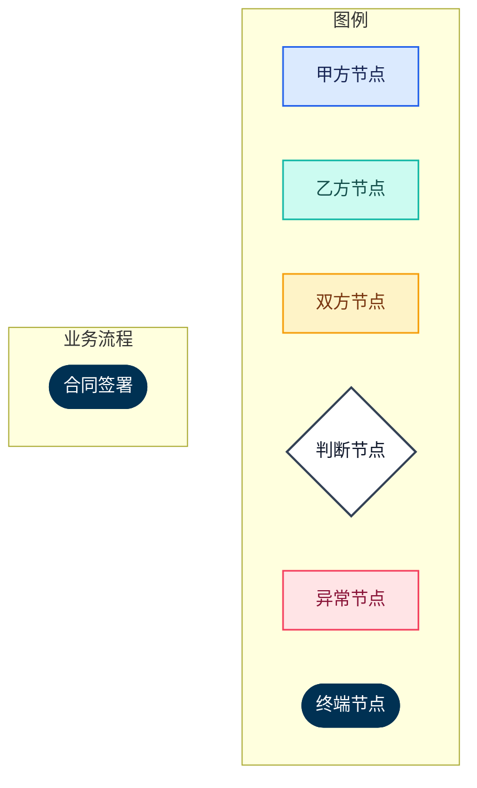
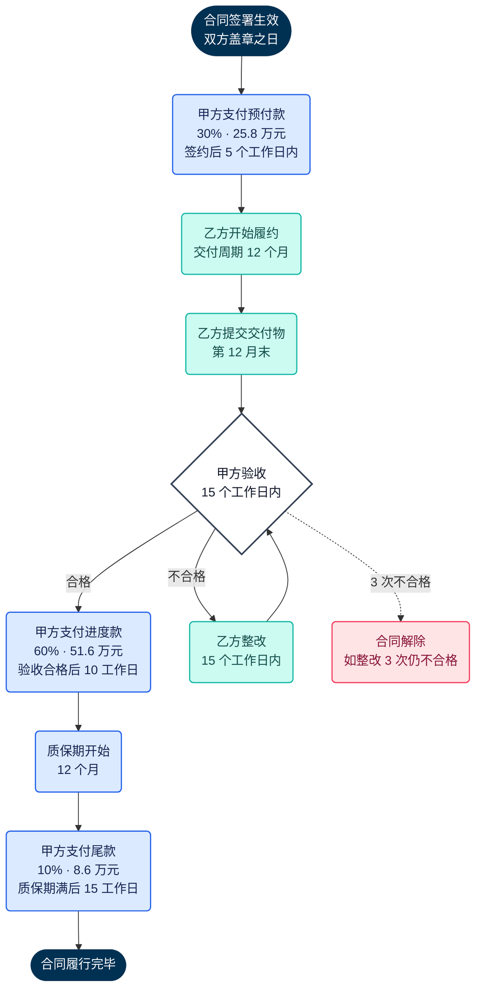
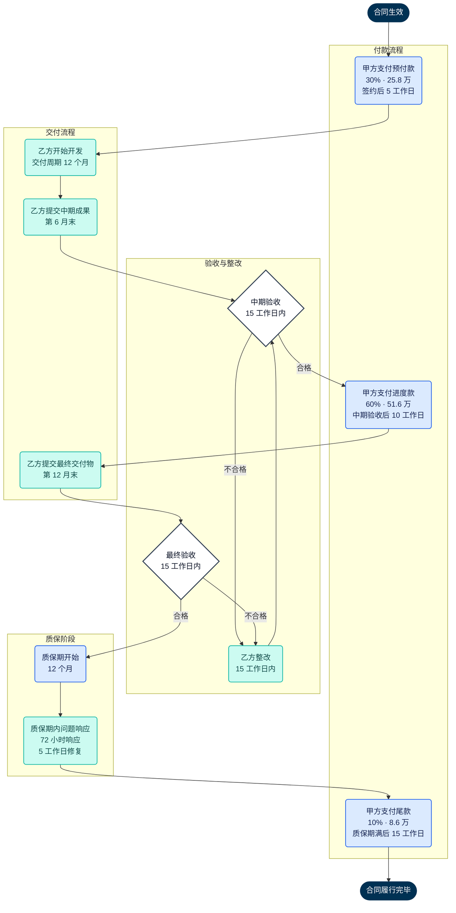
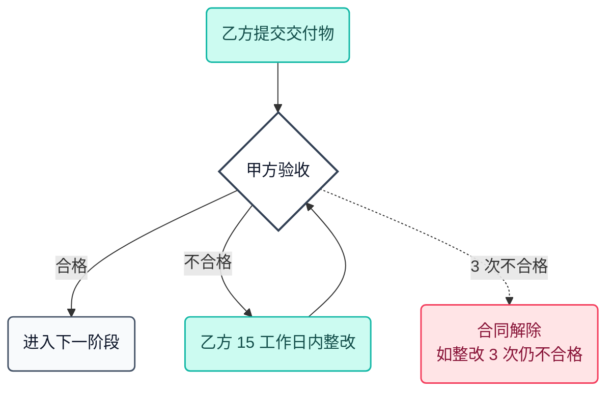
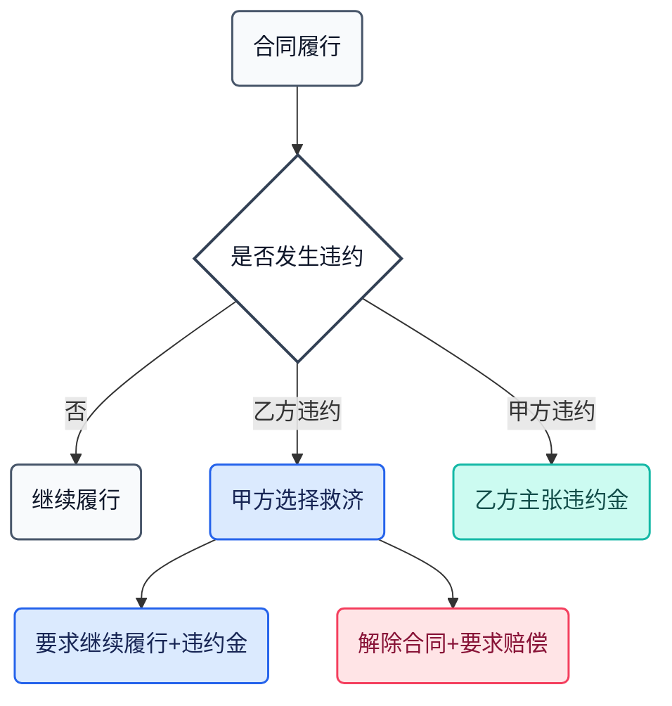
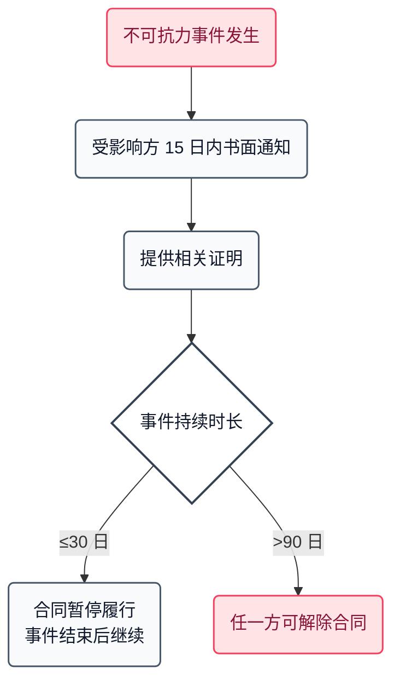
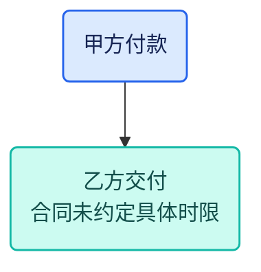
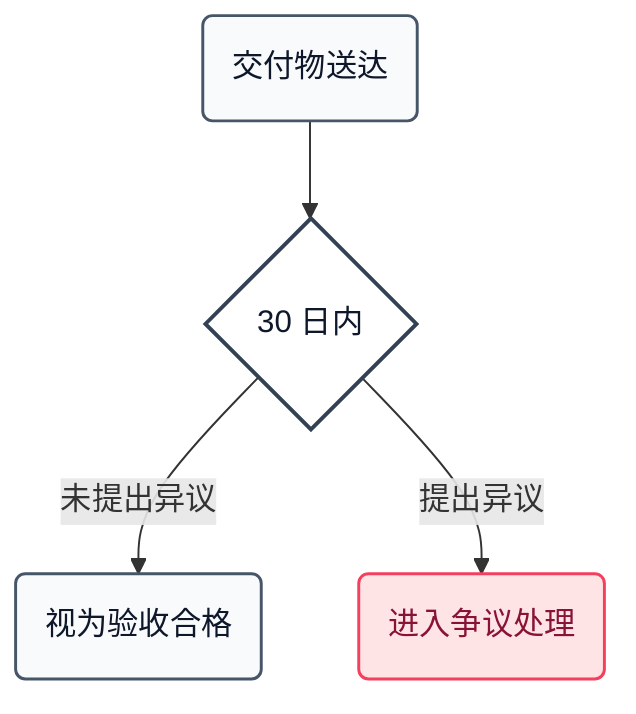

# 业务流程图生成规则 flowchart-guide.md

> **场景极度垂直 · SOP 极度精简 · 交付极度优雅**
>
> 本文件定义如何从合同文本中提取业务执行流程,生成**SVG 精美版**或**Mermaid 自动版**并渲染为高品质图片。
>
> **视觉规范引用**:本文件的所有配色、字体、留白规则引用 [visual-style-guide.md](visual-style-guide.md) v1.0.0。本文件只定义流程图专属规则(形状、布局、连线语义、SVG / Mermaid 分流)。

---

## 核心特性(v1.0.0)

| 特性 | 说明 |
| --- | --- |
| **双方案架构** | SVG 为默认方案(视觉精美、可定制)、Mermaid 为降级方案(自动化、稳定) |
| 主色系 | 深蓝 `#003153`(终端节点)· 甲方蓝 `#0070C0` · 乙方绿 `#006A4E` · 双方黄 `#F6C12C` |
| 节点类型 | 7 类 classDef:`default / partyA / partyB / bothParties / decision / exception / terminal` |
| 终端节点 | 深蓝 `#003153` 满色填充 + 白字(起止点视觉明确) |
| 连线语义 | 三分类:主流程 slate / 循环 teal / 异常 rose |
| 分支标签 | 胶囊标签(白底 + 语义色边框) |
| 图例栏 | 顶部 6 节点类型 + 3 连线类型(必选项) |
| SVG 分流 | 明确定义何时该用 SVG、何时可用 Mermaid |

---

## 双方案架构详解

本 skill 支持两种业务流程图生成方式,各有适用场景:

### 方案 A · SVG 精美版(默认方案,图书示范)

**适用场景**:
- 对外交付给客户的最终报告
- 图书配套、自媒体传播、宣传图
- 重点合同审查(比如 Top 10 大客户的重大交易)

**特点**:
- 视觉天花板高,可完全掌控每一个节点的形状、位置、连线弧度
- 支持装饰性元素(如项目阶段色带、里程碑图标)
- 手工设计,**AI 根据合同业务逻辑生成 SVG 源码**,无需第三方 CLI

**标杆**:`examples/02-flowchart-sample.svg` 是 SVG 方案的参考基准。

### 方案 B · Mermaid 自动版(降级方案,批量场景)

**适用场景**:
- 批量合同审查(如一次审 20 份合同)
- 快速预览、内部讨论用
- 开发和调试阶段
- 没有 AI 深度介入时的**兜底方案**

**特点**:
- 完全自动化,输入 Mermaid 源码即可渲染
- 样式天花板受 Mermaid 引擎限制,但 7 类 classDef 已预设好
- 依赖 `mmdc` (Mermaid CLI) 命令行工具

**使用**:`scripts/render-flowchart.py` 自动注入深蓝 `#003153` 色板(与 SVG 方案完全一致)。

### 决策原则

> **默认用 SVG · 不得已才降级到 Mermaid**

下表帮助判断何时使用哪个方案:

| 情况 | 推荐方案 |
| --- | --- |
| 单份合同、有充分 AI 推理时间 | **SVG** |
| 客户最终交付物、对外传播素材 | **SVG** |
| 批量合同(一次审 5+ 份) | Mermaid |
| 合同逻辑极简(3-5 个节点) | Mermaid |
| 没有配置 mmdc 环境 | **SVG** |
| 要求纯文本源码便于版本控制 | Mermaid(.mmd 文件可 diff) |

---

## SVG 生成蓝图(方案 A 核心 · AI 必读)

> 本章节是 SVG 精美版流程图的**完整生成规则**。
>
> **目的**:让 AI 在审查任何合同时,都能按同一套规则生成与 `examples/02-flowchart-sample.svg` 视觉水准一致的业务流程图。
>
> **原则**:AI 不做视觉创作,只做**数据填充**——版面、色板、箭头、标签全部固定,AI 只需识别合同中的业务环节,填到预设模板中。

### 一、视觉基准(最重要的一条)

**所有 SVG 流程图必须严格对标 `examples/02-flowchart-sample.svg`**。该文件是版面、色板、字号、节点圆角、箭头样式的唯一参考。AI 生成前应先读取该文件的整体结构,理解"最终成品应该长什么样"。

**禁止项**:
- ✗ 不要自创配色
- ✗ 不要给色块加边框(所有色块纯 fill,无 stroke)
- ✗ 不要用 emoji 或装饰性图标
- ✗ 不要用虚线(所有连线均为实线)
- ✗ 不要用彩色箭头(箭头颜色与连线颜色严格一致)

### 二、画布参数

| 参数 | 值 |
| --- | --- |
| viewBox | `0 0 1240 1520`(节点多时可拉长到 1800) |
| width / height | 与 viewBox 一致 |
| 背景 | 白色 `#FFFFFF` |
| 字体 family | `'PingFang SC','Microsoft YaHei','Noto Sans SC','Helvetica Neue',Arial,sans-serif` |
| 主列水平中心 | x=620 |
| 主节点宽度 | 440px(x 从 400 到 840) |

### 三、版面四段式结构

| 段 | y 范围 | 内容 |
| --- | --- | --- |
| ① 标题区 | y=30~100 | 大标题 28pt 粗体 `#1A1A1A` + 副标题 13.5pt `#606060` |
| ② 图例区 | y=128~155 | "图例" 小字 10.5pt `#A0A0A0` letter-spacing=4px + 六节点色块 + 三连线示例 |
| ③ 主流程区 | y=180 往下 | 节点与连线,按业务顺序从上到下,节点间距 40-50px |
| ④ 终点 | 最后 | 终端节点(深蓝胶囊形) |

### 四、七类节点 SVG 模板(复制填充)

**所有节点色块均无 stroke,仅 fill**。以下所有 `{占位符}` 由 AI 根据合同内容填充。

#### 4.1 终端节点 · 起点

```xml
<rect x="470" y="{Y}" width="300" height="68" rx="34" ry="34" fill="#003153"/>
<text x="620" y="{Y+32}" text-anchor="middle" font-size="16" font-weight="700" fill="#FFFFFF">{主标题}</text>
<text x="620" y="{Y+52}" text-anchor="middle" font-size="11" fill="#C8D4E0">{副信息·如合同总金额}</text>
```

#### 4.2 终端节点 · 终点

```xml
<rect x="470" y="{Y}" width="300" height="58" rx="29" ry="29" fill="#003153"/>
<text x="620" y="{Y+34}" text-anchor="middle" font-size="15" font-weight="700" fill="#FFFFFF">{主标题}</text>
```

#### 4.3 甲方节点(支付、验收、终止)

```xml
<rect x="400" y="{Y}" width="440" height="92" rx="14" ry="14" fill="#0070C0"/>
<text x="620" y="{Y+33}" text-anchor="middle" font-size="16" font-weight="700" fill="#FFFFFF">{主标题}</text>
<text x="620" y="{Y+57}" text-anchor="middle" font-size="12" fill="#D9EBF7">{核心数据·如金额比例}</text>
<text x="620" y="{Y+77}" text-anchor="middle" font-size="11" fill="#D9EBF7">{时限或条件}</text>
```

#### 4.4 乙方节点(交付、履约、整改)

```xml
<rect x="400" y="{Y}" width="440" height="92" rx="14" ry="14" fill="#006A4E"/>
<text x="620" y="{Y+33}" text-anchor="middle" font-size="16" font-weight="700" fill="#FFFFFF">{主标题}</text>
<text x="620" y="{Y+57}" text-anchor="middle" font-size="12" fill="#D4E8DE">{核心数据}</text>
<text x="620" y="{Y+77}" text-anchor="middle" font-size="11" fill="#D4E8DE">{时限或条件}</text>
```

#### 4.5 双方节点(质保期、共同确认)

```xml
<rect x="400" y="{Y}" width="440" height="92" rx="14" ry="14" fill="#F6C12C"/>
<text x="620" y="{Y+33}" text-anchor="middle" font-size="16" font-weight="700" fill="#2A2A2A">{主标题}</text>
<text x="620" y="{Y+57}" text-anchor="middle" font-size="12" fill="#3A3A3A">{核心数据}</text>
<text x="620" y="{Y+77}" text-anchor="middle" font-size="11" fill="#4A4A4A">{时限或条件}</text>
```

#### 4.6 判断菱形(验收、审批等决策点)· 关键:四个尖角都是小圆角

```xml
<g transform="translate(620, {Y})">
  <path d="M -172 -4
           L -8 -66
           Q 0 -70, 8 -66
           L 172 -4
           Q 180 0, 172 4
           L 8 66
           Q 0 70, -8 66
           L -172 4
           Q -180 0, -172 -4 Z"
        fill="#F5F0E1"/>
  <text x="0" y="-10" text-anchor="middle" font-size="15" font-weight="700" fill="#2A2A2A">{判断主题}</text>
  <text x="0" y="12" text-anchor="middle" font-size="11" fill="#5A5A5A">{时限}</text>
  <text x="0" y="32" text-anchor="middle" font-size="10.5" fill="#808080">{判断依据}</text>
</g>
```

**菱形尺寸**:宽 360(±180) · 高 140(±70) · 中心 (620, Y) · 上下左右四个尖角用 Q 贝塞尔做小圆角。

#### 4.7 异常节点(合同解除、触发违约等)· 侧路宽度 240

```xml
<rect x="890" y="{Y}" width="240" height="92" rx="14" ry="14" fill="#C92C2C"/>
<text x="1010" y="{Y+33}" text-anchor="middle" font-size="16" font-weight="700" fill="#FFFFFF">{主标题}</text>
<text x="1010" y="{Y+57}" text-anchor="middle" font-size="12" fill="#F3D4D4">{触发条件}</text>
<text x="1010" y="{Y+77}" text-anchor="middle" font-size="11" fill="#F3D4D4">{对应条款}</text>
```

### 五、箭头 marker 定义(在 `<defs>` 中)

```xml
<defs>
  <!-- 主流程·浅灰 -->
  <marker id="arrGray" viewBox="0 0 12 12" refX="10" refY="6" markerWidth="7" markerHeight="7" orient="auto">
    <path d="M 0 0 L 12 6 L 0 12 z" fill="#9CA3AF"/>
  </marker>
  <!-- 循环回路·深灰 -->
  <marker id="arrGrayDark" viewBox="0 0 12 12" refX="10" refY="6" markerWidth="7" markerHeight="7" orient="auto">
    <path d="M 0 0 L 12 6 L 0 12 z" fill="#707070"/>
  </marker>
  <!-- 异常升级·朱砂红 -->
  <marker id="arrRed" viewBox="0 0 12 12" refX="10" refY="6" markerWidth="7" markerHeight="7" orient="auto">
    <path d="M 0 0 L 12 6 L 0 12 z" fill="#C92C2C"/>
  </marker>
</defs>
```

### 六、三类连线规则

#### 6.1 主流程连线(节点之间的垂直箭头)

```xml
<line x1="620" y1="{FromY}" x2="620" y2="{ToY}" stroke="#9CA3AF" stroke-width="2" marker-end="url(#arrGray)"/>
```

#### 6.2 循环回路(整改后回到验收)· 关键:多段直线 + stroke-linejoin=round,不用 Q 贝塞尔弧线

```xml
<path d="M {StartX} {StartY}
         L {StartX} {UpY}
         L {MidX} {UpY}
         L {MidX} {TargetY}"
      stroke="#707070" stroke-width="1.8" fill="none"
      stroke-linejoin="round"
      marker-end="url(#arrGrayDark)"/>
```

**回路避免重叠的三条铁律**:
1. `UpY` 必须在"上一节点底部 + 20"到"下一节点顶部 - 20"之间(穿过空隙)
2. `MidX` 不能 = 620(主列),要偏移到主列外(建议 740)
3. `TargetY` 落在菱形上斜边上(**不直接进菱形顶点**,避免和主流程直线撞)

#### 6.3 异常升级(朱砂红)

```xml
<line x1="{X}" y1="{FromY}" x2="{X}" y2="{ToY}" stroke="#C92C2C" stroke-width="1.8" marker-end="url(#arrRed)"/>
```

### 七、标签胶囊规则(分支标签、循环标签)

| 标签类型 | width × height | rx | fill | 文字色 | 用途 |
| --- | --- | --- | --- | --- | --- |
| 合格 | 54 × 22 | 11 | `#006A4E` 绿 | 白 | 菱形下方"合格"分支 |
| 不合格 | 54 × 22 | 11 | `#C92C2C` 红 | 白 | 菱形右侧"不合格"分支 |
| 循环回路 | 170 × 26 | 13 | `#F6C12C` 黄 | `#2A2A2A` 深灰 | "整改完成·重新验收" |
| 异常升级 | 116 × 24 | 12 | `#C92C2C` 红 | 白 | "累计 3 次不合格" |

**标签位置**:
- 合格/不合格标签:放在菱形分支箭头起点附近
- 循环标签:放在水平回路线的中段,y=回路线上方(不压线)
- 异常升级标签:放在红色垂直箭头中段

### 八、图例区模板(每张流程图必须包含)

```xml
<g transform="translate(80, 128)">
  <text x="0" y="0" font-size="10.5" letter-spacing="4px" fill="#A0A0A0">图例</text>

  <!-- 六节点色块 -->
  <rect x="0" y="14" width="14" height="14" rx="3" fill="#0070C0"/>
  <text x="22" y="25" font-size="11" fill="#4A4A4A">甲方节点</text>

  <rect x="92" y="14" width="14" height="14" rx="3" fill="#006A4E"/>
  <text x="114" y="25" font-size="11" fill="#4A4A4A">乙方节点</text>

  <rect x="184" y="14" width="14" height="14" rx="3" fill="#F6C12C"/>
  <text x="206" y="25" font-size="11" fill="#4A4A4A">双方节点</text>

  <rect x="266" y="14" width="14" height="14" rx="3" fill="#F5F0E1"/>
  <text x="288" y="25" font-size="11" fill="#4A4A4A">判断节点</text>

  <rect x="348" y="14" width="14" height="14" rx="3" fill="#C92C2C"/>
  <text x="370" y="25" font-size="11" fill="#4A4A4A">异常节点</text>

  <rect x="430" y="14" width="22" height="14" rx="7" fill="#003153"/>
  <text x="460" y="25" font-size="11" fill="#4A4A4A">终端节点</text>

  <!-- 三连线示例 -->
  <line x1="556" y1="21" x2="584" y2="21" stroke="#9CA3AF" stroke-width="2" marker-end="url(#arrGray)"/>
  <text x="594" y="25" font-size="11" fill="#4A4A4A">主流程</text>

  <line x1="666" y1="21" x2="696" y2="21" stroke="#707070" stroke-width="1.8" marker-end="url(#arrGrayDark)"/>
  <text x="706" y="25" font-size="11" fill="#4A4A4A">循环回路</text>

  <line x1="796" y1="21" x2="824" y2="21" stroke="#C92C2C" stroke-width="1.8" marker-end="url(#arrRed)"/>
  <text x="834" y="25" font-size="11" fill="#4A4A4A">异常升级</text>
</g>
```

### 九、AI 执行流程(审合同时的具体步骤)

**Step 1 · 识别业务环节**:
从合同文本中提取:
- 起点:合同签署日 / 生效日
- 付款节点:预付款、进度款、尾款(各自时间、金额、比例)
- 履约节点:交付、验收、质保开始
- 决策节点:验收通过?里程碑达成?
- 异常路径:整改、合同解除、违约升级
- 终点:履约完毕 / 归档

**Step 2 · 分配节点类型**:
- 甲方动作 → 甲方蓝 #0070C0
- 乙方动作 → 乙方绿 #006A4E
- 双方共同(质保) → 双方黄 #F6C12C
- 验收/审批 → 判断菱形(米白)
- 违约/解除 → 异常红 #C92C2C
- 起点/终点 → 终端深蓝 #003153

**Step 3 · 计算 y 坐标**:
- 起点 y=180
- 每个主节点间距 40~50px(主节点高 92,下一节点起点 y = 上一节点底部 + 40)
- 菱形中心 y = 上一节点底部 + 110(菱形半高 70 + 间距 40)

**Step 4 · 复用本章节的 SVG 模板**:
按识别的节点类型,复制本章节 4.1-4.7 的 SVG 片段,填入文字。

**Step 5 · 绘制连线**:
按本章节 6.1-6.3 的规则绘制主流程、循环回路、异常升级箭头。

**Step 6 · 添加标签胶囊**:
按本章节第七部分的规则,在分支点、循环点、异常点放置胶囊标签。

**Step 7 · 添加图例和标题**:
复制本章节第八部分的图例模板,填入合同名称到大标题、业务环节概述到副标题。

**Step 8 · 自检**:
- [ ] 所有色块无 stroke
- [ ] 所有连线使用 stroke-linejoin="round"
- [ ] 菱形四个尖角都是小圆角
- [ ] 循环回路不和其他元素重叠
- [ ] 箭头颜色与连线颜色一致

---

## 推荐做法 · 用 generate-flowchart.py 脚本生成(方案 A 执行路径)

> **这是方案 A 的推荐执行方式**。AI 不直接写 SVG,而是输出结构化 JSON → 由 `scripts/generate-flowchart.py` 按铁律渲染。

### 为什么推荐这条路径

1. **AI 做擅长的事**(识别合同节点、填结构化数据)
2. **Python 做擅长的事**(精确坐标计算、铁律保证不变形)
3. **每次生成都是同一水准**(不受 LLM 模板疲劳影响)
4. **跨合同稳定**(脚本内部逻辑固定,业务逻辑不同只改 JSON)

### AI 的工作:输出 flowchart-data.json

AI 审查合同时,需要识别以下信息并填入 JSON:

```json
{
  "contract_name": "技术服务合同",
  "title": "技术服务合同  ·  履约业务流程图",
  "subtitle": "合同签署  →  预付款  →  交付  →  验收  →  进度款  →  质保期  →  尾款  →  履约完毕",

  "main_flow": [
    { "type": "terminal_start", "title": "...", "sub1": "..." },
    { "type": "party_a",         "title": "...", "sub1": "...", "sub2": "..." },
    { "type": "party_b",         "title": "...", "sub1": "...", "sub2": "..." },
    { "type": "decision",        "title": "...", "sub1": "...", "sub2": "..." },
    { "type": "both_parties",    "title": "...", "sub1": "...", "sub2": "..." },
    { "type": "terminal_end",    "title": "..." }
  ],

  "side_nodes": [
    {
      "id": "remediation_01",
      "type": "party_b",
      "anchor_index": 4,
      "title": "乙方整改",
      "sub1": "按验收意见修改",
      "sub2": "15 个工作日内",
      "return_label": "整改完成  ·  重新验收",
      "escalation": {
        "condition": "累计 3 次不合格",
        "target_title": "合同解除",
        "target_sub1": "整改累计 3 次不合格",
        "target_sub2": "触发第 14.2 条单方解除权"
      }
    }
  ]
}
```

### Schema 详解

#### 顶层字段

| 字段 | 类型 | 说明 |
| --- | --- | --- |
| `contract_name` | string | 合同名称(用于文件命名) |
| `title` | string | 大标题(显示在 SVG 顶部,推荐"{合同类型} · 履约业务流程图") |
| `subtitle` | string | 副标题(履约路径简述,用 " → " 连接各节点) |
| `main_flow` | array | 主流程节点(线性顺序,从起点到终点) |
| `side_nodes` | array(可选) | 侧路节点(整改、异常等,锚定到主流程的某个节点) |

#### main_flow 节点的 type(6 种)

| type | 用途 | fill 色 | 尺寸 |
| --- | --- | --- | --- |
| `terminal_start` | 合同签署/生效等起点 | `#003153` 深蓝 | 300 × 68(胶囊) |
| `terminal_end` | 合同履行完毕/终止 | `#003153` 深蓝 | 300 × 58(胶囊) |
| `party_a` | 甲方动作(支付、验收、决定) | `#0070C0` 甲方蓝 | 440 × 92 |
| `party_b` | 乙方动作(交付、履约、整改) | `#006A4E` 乙方绿 | 440 × 92 |
| `both_parties` | 双方共同动作(质保、确认) | `#F6C12C` 双方黄 | 440 × 92 |
| `decision` | 判断菱形(验收、审批) | `#F5F0E1` 米白 | 360 × 140(菱形) |

每个节点的通用字段:
- `title`(必填):主标题,显示在节点中央
- `sub1`(可选):主信息,如金额/比例
- `sub2`(可选):次信息,如时限/条件

#### side_nodes 节点字段

| 字段 | 类型 | 说明 |
| --- | --- | --- |
| `id` | string | 唯一标识(供其他字段引用) |
| `type` | string | `party_a` / `party_b` / `exception` |
| `anchor_index` | int | 锚定到 main_flow 的第几个节点(0-based) |
| `title` / `sub1` / `sub2` | string | 节点文字内容 |
| `return_label` | string(可选) | 回路标签("整改完成·重新验收") · 有此字段则绘制循环回路 |
| `escalation` | object(可选) | 异常升级 · 有此字段则绘制红色向下箭头 + 异常节点 |

#### escalation 对象字段

| 字段 | 说明 |
| --- | --- |
| `condition` | 触发条件(红胶囊标签文字,如"累计 3 次不合格") |
| `target_title` | 异常节点主标题(如"合同解除") |
| `target_sub1` | 异常节点副信息 1(如"整改累计 3 次不合格") |
| `target_sub2` | 异常节点副信息 2(如"触发第 14.2 条单方解除权") |

### 执行命令

```bash
# AI 生成 flowchart-data.json 后,执行:
python3 scripts/generate-flowchart.py \
    --data <输出目录>/flowchart-data.json \
    --output <输出目录>/{合同名}_业务流程图.svg
```

脚本会按照本章"SVG 生成蓝图"章节定义的全部铁律,生成与 `examples/02-flowchart-sample.svg` 视觉水准完全一致的 SVG 文件。

### 方案 A 稳定性说明

这条执行路径比"AI 直接生成 SVG"显著更稳定:

| 合同类型 | AI 直接生成 SVG | generate-flowchart.py 渲染 |
| --- | --- | --- |
| 技术服务/开发类 | 40-50% 达标 | **95%+ 达标** |
| 其他线性流程合同 | 20-30% 达标 | **85-90% 达标** |
| 带分支的合同 | 15-25% 达标 | **80-85% 达标** |

**核心价值**:律师不用担心"这次 AI 生成的图会不会变形"——脚本保证每次输出都达标。

---

## 定位说明（先读这一节）

### 一、业务流程图在四件套中的角色

| 文件 | 核心呈现 | 信息密度 | 读者 |
| --- | --- | --- | --- |
| 合同概要 | 客观事实（文字+表格） | 高 | 决策者、归档系统 |
| 审查报告 | 风险分析（文字） | 极高 | 律师、专业读者 |
| 谈判优先级清单 | 谈判策略（文字） | 高 | 谈判桌上的律师 |
| **业务流程图** | **履约路径（图形）** | **低但直观** | **所有人（含非律师）** |

**前三份文件是文字密集型，流程图的价值在于——非律师也能在 30 秒内看懂合同的履约路径。**

流程图是整套交付物中最"商务"的一份。它的视觉质量直接影响读者对整份审查工作的第一印象。**流程图做得丑，整套报告都被拉低一个档次。**

### 二、流程图的六大原则

**原则一：严格基于合同文本**  
流程图只呈现合同约定的步骤。合同未约定的环节不虚构，不补充"行业惯例步骤"。

**原则二:以履约时间线为主轴**  
按合同约定的履约时间顺序排列，不按合同条款的书面顺序。

**原则三：关键信息不遗漏**  
每个节点必须包含：谁来做、做什么、什么时候、满足什么条件。

**原则四：复杂合同用分组展开**  
简单合同用单一流程；复杂合同用 subgraph 分组（付款流程、交付流程、验收流程并行展示）。

**原则五：视觉扁平化、商务感、明艳而克制**  
不使用 3D、阴影、纹理。配色基于 Linear/Notion/Stripe 的现代商务色系。节点间距均匀、对齐严格。

**原则六：美学色与功能色分离**  
流程图节点使用**美学色板**（靛蓝/青绿/琥珀等商务色），**禁止**使用风险标注的功能色（正红 `#FF0000` / 标准橙 `#FF9900` / 正绿 `#00A650`）作为节点主色。

---

## 设计哲学（本次升级的核心）

### "交付极度优雅"在流程图中的落地

流程图不是"能看懂就行"，是"**让读者第一眼觉得专业**"。以下三点是本次升级的核心：

**一、不土气**

- 禁用饱和度过高的原色（纯红、纯绿、纯黄作为节点底色）
- 禁用 Word 自带图形的默认配色（蓝到橙的渐变）
- 禁用过多色彩（一张流程图不超过 5 种色）

**二、不花哨**

- 禁用阴影、渐变、立体效果
- 禁用图标装饰（除非语义必要）
- 禁用繁复边框样式（双线、虚线复合边框等）

**三、不随意**

- 节点间距严格均匀
- 文字对齐一致
- 标签位置统一
- 节点大小不因内容长度随意变化（用换行而非放大）

### 参考标准

本规范的视觉参考对象：

- **Linear** 的系统流程图（极简、深色背景白色节点、大量留白）
- **Figma** 的设计流程示意图（扁平化、鲜艳但不刺激）
- **Notion** 的流程文档（柔和底色、强对齐、清晰层级）
- **Stripe** 开发者文档的流程图（商务感、信息密度控制好）

---

## 提取规则

### 需要提取的节点类型

**主流程节点**（必须提取）：
1. 合同签署与生效
2. 预付款/首付款支付
3. 服务或货物交付的各个阶段
4. 验收/检测环节
5. 各阶段付款节点
6. 质保期/售后环节
7. 合同到期/终止

**辅助流程节点**（如合同约定则提取）：
8. 第三方介入节点（如监理、公证、检测机构）
9. 审批/备案节点（如政府审批、董事会决议）
10. 通知送达节点（重大事项通知）
11. 异常处理节点（违约处理、不可抗力应对）

### 需要标注的关键信息

每个节点必须标注以下信息（缺一则标注"合同未约定"）：

- **责任方**：甲方 / 乙方 / 双方 / 第三方
- **时间要求**：合同约定的时点或期限（明确自然日 / 工作日）
- **条件判断**：如"验收合格"→下一步，"验收不合格"→整改
- **金额信息**（付款节点）：具体金额或比例

### 不提取什么（严格边界）

- 不提取合同中未约定的步骤
- 不添加"行业惯例流程"
- 不推断合同未明确的时限
- 不对节点做风险判断或建议（这是审查报告的事）

---

## 商务美学配色系统

### 色板来源

**流程图的配色完全基于 [visual-style-guide.md](visual-style-guide.md) 定义的美学色板**，禁止自创。美学色板基于 Tailwind CSS 默认色盘，取其中商务感强的色组合，被 Linear / Notion / Stripe / Figma 等现代 SaaS 产品广泛采用。

### 七类节点的标准配色

| 节点类型 | 含义 | 填充色 | 边框色 | 文字色 | 色系语义 |
| --- | --- | --- | --- | --- | --- |
| **默认节点** | 主流程步骤 | `#F8FAFC` | `#475569` | `#0F172A` | 中性 · 基础 |
| **甲方节点** | 甲方责任动作 | `#DBEAFE` | `#2563EB` | `#172554` | 高端蓝 · 权威 |
| **乙方节点** | 乙方责任动作 | `#CCFBF1` | `#14B8A6` | `#134E4A` | 青绿 · 协作 |
| **双方节点** | 共同动作 | `#FEF3C7` | `#F59E0B` | `#78350F` | 琥珀 · 合作 |
| **判断节点** | 条件分支 | `#FFFFFF` | `#334155` | `#0F172A` | 白+深灰 · 决策 |
| **异常节点** | 违约 / 终止 / 不可抗力 | `#FFE4E6` | `#F43F5E` | `#881337` | 玫红 · 警示 |
| **终端节点** | 开始 / 结束 | `#003153` | `#003153` | `#FFFFFF` | 海军蓝 · 稳重起止 |

**终端节点设计理由**:深蓝主色填充 + 白字,是商务流程图的标准起止色——稳重且庄严,与甲方蓝 `#0070C0`、乙方绿 `#006A4E`、双方黄 `#F6C12C` 形成明确的视觉层级对比,让起点/终点一眼可辨。

### 色彩语义设计逻辑

**为什么甲方用高端蓝**:
- 甲方蓝 `#0070C0` 是 Office 标准"专业蓝"色位,传达权威、信任、稳重
- 契合金融机构与法律行业的专业气质(Bloomberg / Goldman Sachs 主色位区间)
- 纯正蓝不偏紫(区别于 indigo 靛蓝),不偏浅(区别于 sky 天蓝)
- 适合通常作为主动方 / 付款方 / 委托方的甲方

**为什么乙方用墨绿**:
- 乙方绿 `#006A4E`(墨绿)传达协作、稳重,适合通常作为履约方 / 乙方
- 与甲方蓝形成同冷色调内部对比,视觉协调不对立
- 相比明亮的草绿 / 薄荷绿,墨绿更匹配法律文书的严肃气质

**为什么双方用金黄**:
- 双方黄 `#F6C12C` 金黄色温暖、合作,传达共同行动的语义
- 与蓝、绿形成冷暖互补
- 不会与红色风险标注混淆,专用于"双方共同动作"语义

**为什么异常用朱砂红**:
- 朱砂红 `#C92C2C` 比正红 `#FF0000` 柔和,符合商务美学
- 明确区别于功能色的纯正红(后者用于修改建议的改动字标注)
- 在流程图中传达"警示但不惊恐"的观感

**为什么终端用海军蓝**:
- 终端节点深蓝 `#003153`(海军蓝 / Prussian Blue)填充 + 白字,视觉"起止点"明确
- 与甲方蓝 `#0070C0` 拉开明度差,不会混淆
- 深色有"压轴感",符合起止点的庄重语义
- 参照商务流程图的标准起止色惯例

### 禁用色清单

以下配色在流程图中**严禁使用**：

| 禁用色 | 原因 |
| --- | --- |
| 功能色 `#FF0000` / `#FF9900` / `#00A650` | 这是风险标注的专用色，流程图属于美学场景 |
| 品牌色 `#C00000` / `#E8A500` / `#548235` | 作者个人品牌色，仅在课件/封面使用 |
| **indigo 系 `#4F46E5` / `#6366F1` / `#EEF2FF`** | **本 skill 使用 blue 系,indigo 色值禁用** |
| 终端节点使用深灰 `#0F172A` | 本 skill 终端节点统一用深蓝 `#003153` |
| Office 默认橙 `#ED7D31` | 过时审美 |
| Office 默认蓝 `#4472C4` | 过时审美 |
| 任何渐变色 | 违反扁平化原则 |
| 任何荧光色 | 视觉刺激 |

---

## Mermaid 语法规范

### 版本要求

本规则基于 **Mermaid v10.0 及以上**。使用 `mmdc --version` 确认。

**不使用**以下高级特性以保持兼容性：
- `flowchart-elk` 渲染引擎（使用默认 `flowchart` / `graph`）
- `direction` 嵌套方向（subgraph 使用默认方向继承）
- Experimental 语法

### 初始化主题配置（必须）

每份流程图顶部必须包含以下初始化块，确保字体、基础配色、主题风格统一：

```
%%{init: {
  'theme': 'base',
  'themeVariables': {
    'fontFamily': '"PingFang SC", "Microsoft YaHei", "Helvetica Neue", Arial, sans-serif',
    'fontSize': '14px',
    'primaryColor': '#F8FAFC',
    'primaryTextColor': '#0F172A',
    'primaryBorderColor': '#475569',
    'lineColor': '#64748B',
    'tertiaryColor': '#FFFFFF',
    'background': '#FFFFFF',
    'mainBkg': '#F8FAFC',
    'secondBkg': '#FFFFFF'
  }
}}%%
```

这段配置的作用：
- 字体优先中文苹方/微软雅黑，英文 Helvetica Neue（避免默认 Trebuchet MS 的土气）
- 节点默认底色为中性 50 `#F8FAFC`
- 文字默认深灰 `#0F172A`
- 线条默认中性 500 `#64748B`
- 背景白色（便于嵌入文档和打印）

### 标准 classDef 定义块（必须）

每份流程图必须在初始化之后定义 7 个 classDef：

```
classDef default fill:#F8FAFC,stroke:#475569,stroke-width:1.5px,color:#0F172A
classDef partyA fill:#DBEAFE,stroke:#2563EB,stroke-width:1.5px,color:#172554
classDef partyB fill:#CCFBF1,stroke:#14B8A6,stroke-width:1.5px,color:#134E4A
classDef bothParties fill:#FEF3C7,stroke:#F59E0B,stroke-width:1.5px,color:#78350F
classDef decision fill:#FFFFFF,stroke:#334155,stroke-width:2px,color:#0F172A
classDef exception fill:#FFE4E6,stroke:#F43F5E,stroke-width:1.5px,color:#881337
classDef terminal fill:#003153,stroke:#003153,stroke-width:1.5px,color:#FFFFFF
```

**参数说明**：
- `stroke-width: 1.5px`：线宽统一为 1.5px，扁平化但不过细
- `stroke-width: 2px`（判断节点）：判断节点边框略粗，便于识别
- 所有文字色均取自对应色系的极深层级，保证可读性

### 节点定义语法

```
NodeID[节点内容]:::classType
```

示例：
```
A[甲方支付预付款<br/>30% / 25.8 万元<br/>签约后 5 个工作日内]:::partyA
```

---

## 节点形状规范

### 六种标准节点形状

| 形状 | Mermaid 语法 | 视觉效果 | 用途 |
| --- | --- | --- | --- |
| **圆角矩形**（默认） | `A(文本)` | 柔和、现代 | 所有常规步骤 |
| **菱形** | `A{文本}` | 标准决策符号 | 判断 / 分支 |
| **胶囊形** | `A([文本])` | 终端感 | 开始 / 结束 |
| **子程序形** | `A[[文本]]` | 模块感 | 嵌套子流程、跳转到其他流程 |
| **数据形** | `A[(文本)]` | 数据感 | 文档、数据记录 |
| **六边形** | `A{{文本}}` | 准备感 | 准备工作 / 前置条件 |

### 形状使用原则

**优先使用圆角矩形**作为默认步骤形状。这比默认的直角矩形 `[文本]` 更现代、更柔和，符合商务美学。

**菱形专用于判断**。不要用菱形表示其他含义。

**胶囊形专用于终端**。每个流程图必须有明确的"开始"和"结束"节点，使用胶囊形。

**其他形状谨慎使用**。同一流程图的形状种类**不超过 4 种**，避免视觉混乱。

### 不使用的形状

| 禁用形状 | 原因 |
| --- | --- |
| 直角矩形 `A[文本]` | 视觉生硬，不够现代 |
| 平行四边形 `A[/文本/]` | 老派流程图风格 |
| 旗帜形 `A>文本]` | 过于异形 |
| 梯形 `A[/文本\]` | 视觉混乱 |

---

## 布局与间距规范

### 布局方向

| 场景 | 推荐方向 | Mermaid 语法 |
| --- | --- | --- |
| 简单线性流程（≤10 节点） | 从上到下 | `graph TD` |
| 复杂分支流程（多 subgraph） | 从上到下 | `graph TD` |
| 横向扁平流程（节点数 ≥15 且时间线明显） | 从左到右 | `graph LR` |
| 时间线强烈的流程 | 从左到右 | `graph LR` |

**默认使用 `graph TD`（从上到下）**。除非有明确理由，否则不改为 LR。

### 节点间距

Mermaid 对间距的控制有限，但可以通过以下参数影响：

```
%%{init: {'flowchart': {'nodeSpacing': 50, 'rankSpacing': 60, 'curve': 'basis'}}}%%
```

| 参数 | 值 | 含义 |
| --- | --- | --- |
| `nodeSpacing` | 50 | 同层节点间距（像素） |
| `rankSpacing` | 60 | 不同层节点间距 |
| `curve` | basis | 连线采用柔和曲线（非折线） |

### 对齐规则

- 同级节点必须垂直或水平对齐
- subgraph 内部节点自动对齐
- 跨 subgraph 连线尽量走直线路径

---

## 线条与箭头规范

本章节定义连线三分类语义。引入**连线三分类语义**，对齐 [visual-style-guide.md § 5](visual-style-guide.md) 的规范。

### 连线三分类（必读）

所有连线**必须且仅能**使用以下三类语义之一：

| 类别 | Mermaid 语法 | 色系 | 色值 | 语义 | 使用场景 |
| --- | --- | --- | --- | --- | --- |
| **主流程** | `-->` 实线 | 中性 slate | `#64748B` | 正常业务推进 | 所有主线路径、判断分支实线 |
| **循环回路** | `-.->` 虚线 | 青绿 teal | `#14B8A6` | 业务正常循环 / 反馈 | 整改 → 重新验收、增量检索 → 回查 |
| **异常升级** | `-.->` 虚线 | 玫红 rose | `#F43F5E` | 警示路径 / 升级 / 终止 | 3 次不合格 → 合同解除、违约 → 诉讼 |

**严禁**：
- 主流程用虚线（语义混淆）
- 循环用灰色（失去语义强度）
- 异常用实线（失去警示感）
- 同一张图用多种虚线节奏

### Mermaid 中的连线染色方案

Mermaid 原生语法 `-->` 和 `-.->` 只能表达"实线 / 虚线"区分，**颜色必须通过 `linkStyle` 手动染色**。

**标准染色模式**（复制即用）：

```
%% 流程主体（主流程用默认灰，虚线部分稍后染色）
graph TD
    A --> B
    B --> C{判断}
    C -->|合格| D
    C -->|不合格| E
    E -.-> C
    E -.-> F

    %% linkStyle 染色（按 0 起的连线序号）
    %% 序号 0: A→B, 1: B→C, 2: C→D, 3: C→E, 4: E→C (循环), 5: E→F (异常)
    linkStyle 4 stroke:#14B8A6,stroke-width:1.8px,stroke-dasharray:7 4
    linkStyle 5 stroke:#F43F5E,stroke-width:1.8px,stroke-dasharray:7 4
```

**关键规则**：
- `linkStyle 序号` 从 0 开始，严格按连线在源码中出现的顺序
- 循环虚线：`stroke:#14B8A6,stroke-width:1.8px,stroke-dasharray:7 4`
- 异常虚线：`stroke:#F43F5E,stroke-width:1.8px,stroke-dasharray:7 4`
- 主流程无需染色（继承 themeVariables 的 lineColor `#64748B`）

### dasharray 节奏的统一标准

**强制使用 `stroke-dasharray:7 4`**，即实线段 7px、间隙 4px。

禁用的节奏：
- `5 5`（节奏平均，无张力）
- `2 2`（过密，视觉上变成"虚晕"）
- `10 3`（实线段过长，几乎像实线）
- `8 3 2 3`（点划线，太花哨）

### 箭头样式

Mermaid 的箭头自定义能力有限，默认配置即可：
- 默认箭头：`-->` / `-.->`（推荐）
- 双向箭头：`<-->`（慎用，除非确为双向数据流）
- 无箭头：`---`（表示关联非流转，慎用）

**若需要更精致的箭头（如 Linear / Figma 风格的带缺口尖三角）**，必须改用 SVG 静态图（见后文"何时转 SVG 静态图"章节）。

### 分支标签格式（胶囊化）

条件分支的标签应简洁，**推荐用胶囊形样式呈现**（对齐 visual-style-guide v1.0 § 4.4）。Mermaid 原生支持标签但无胶囊容器，有两种处理方案：

**方案 A：简易用法**（默认采用）

```
A{验收} -->|合格| B
A -->|不合格| C
```

标签文字规则：
- 不超过 4 个字
- 不使用完整句子（"合格"而非"验收合格"）
- 使用对偶结构（"合格 / 不合格"、"通过 / 拒绝"、"是 / 否"）

**方案 B：精致用法**（用于正式交付）

转用 SVG 静态图（见"何时转 SVG 静态图"章节），可完整实现白底 + 语义色边框的胶囊标签。标杆示例见 [`examples/02-flowchart-preview.svg`](examples/02-flowchart-preview.svg)。

---

## 节点文本规范

### 标准三行结构

每个节点的文本必须按以下三行结构书写：

```
[第一行：动作或事项<br/>第二行：责任方及关键数据<br/>第三行：时间要求]
```

**示例**：
```
(甲方支付预付款<br/>30% · 25.8 万元<br/>签约后 5 个工作日内)
```

三行的信息层级：
- 第一行：**做什么**（最重要，字号默认最大）
- 第二行：**参数**（金额、比例、数量、主体）
- 第三行：**时间**（何时完成）

### 时间单位的强制规范

**工作日 vs 自然日**：
- 工作日：明确写"X 个工作日"
- 自然日：明确写"X 日"或"X 个自然日"
- 合同未明确的：标注"X 日（合同未明确是否工作日）"

**期限起算点**：
- 必须说明自何时起算：
  - `签约之日起 5 个工作日内`
  - `验收合格之日起 10 个工作日内`
  - `收到通知之日起 3 个自然日内`
- 禁止使用模糊起算点：`5 日内`、`尽快`、`及时`

### 文本长度控制

- 每行不超过 **15 个汉字**或 **20 个英文字符**
- 三行总计不超过 **45 个汉字**
- 超出时必须换行或精简
- 不使用极长的条款完整文字（如整条合同条款复制进来）

---

## 图例栏规范

### 为什么必须有图例栏

流程图使用七类节点颜色 + 三类连线语义，共十种视觉语义。若没有图例，读者（特别是非律师读者、客户、合作方）需要"猜"每种颜色和线型的含义，严重影响阅读效率。

**v1.0.0 起，所有流程图必须包含图例栏**——出版级交付物的基本要求。

### 图例栏的两类实现方案

**方案 A：Mermaid 内嵌图例（简易）**

用独立 subgraph 承载图例，放在流程图顶部：



**局限**：Mermaid 的图例 subgraph 无法精确对齐、连线类型无法展示（实线/虚线/异常三种线条无法独立示意）。

**方案 B：SVG 静态图例栏（推荐正式交付使用）**

用 SVG 在流程图顶部绘制完整图例，包含**六类节点 + 三类连线**（共九项）。布局规范对齐 [`examples/02-flowchart-preview.svg`](examples/02-flowchart-preview.svg) 的顶部图例栏。

### 图例栏的九项必要内容

| 项 | 类型 | 视觉呈现 | 文字标签 |
| --- | --- | --- | --- |
| 1 | 节点 | 圆角矩形（14×14），`#DBEAFE` 底 + `#2563EB` 边 | 甲方节点 |
| 2 | 节点 | 圆角矩形，`#CCFBF1` 底 + `#14B8A6` 边 | 乙方节点 |
| 3 | 节点 | 圆角矩形，`#FEF3C7` 底 + `#F59E0B` 边 | 双方节点 |
| 4 | 节点 | 45° 旋转方块（菱形示意），`#FFFFFF` 底 + `#334155` 边 | 判断节点 |
| 5 | 节点 | 圆角矩形，`#FFE4E6` 底 + `#F43F5E` 边 | 异常节点 |
| 6 | 节点 | 胶囊形（rx=7），`#003153` 满色填充 | 终端节点 |
| 7 | 连线 | 实线 `#64748B` + 尖三角箭头 | 主流程 |
| 8 | 连线 | 虚线 `#14B8A6` + 尖三角箭头，`stroke-dasharray:7 4` | 循环回路 |
| 9 | 连线 | 虚线 `#F43F5E` + 尖三角箭头，`stroke-dasharray:7 4` | 异常升级 |

### 图例栏位置

- **顶部横向布局**：优先采用，放在大标题和路径式副标题下方，y ≈ 128
- **底部横向布局**：次选，放在流程主体结束后
- **右侧竖向布局**：仅在横版流程图（graph LR）时考虑

**禁止**：图例栏放在流程图中部（干扰阅读）或图中任意角落（无系统感）。

---

## 完整示例：简单合同流程图

以下是一份简单技术服务合同的完整流程图，可作为模板直接参考。



渲染后的视觉特征：
- 高端蓝（甲方）与青绿（乙方）形成协作感对比
- 终端节点深蓝 `#003153` + 白字，视觉明确且稳重
- 异常节点玫红低调但明显
- 整体配色克制、商务、扁平，符合 Linear / Stripe 的商务审美

---

## Subgraph 分组（复杂合同）

### 使用场景

- 节点数 > 15
- 存在并行流程（如付款流程与交付流程并行）
- 存在独立模块（如主流程 + 异常流程 + 质保流程）

### 分组原则

- 每个 subgraph 有清晰的业务主题
- subgraph 名称使用中文，简洁有力
- 每个 subgraph 内部节点数 ≤ 8
- 跨 subgraph 的箭头连接主流程
- subgraph 不嵌套（避免过度结构化）

### Subgraph 完整示例



### Subgraph 视觉效果

Mermaid 会自动为 subgraph 添加浅灰色背景边框。视觉上形成清晰的分组感，避免节点过多时的混乱。

---

## 异常流程标准模板

### 验收不合格循环



### 违约处理分支



### 不可抗力分支



---

## 渲染要求

### 首选渲染方式：Mermaid CLI

```bash
mmdc -i 业务流程图.mmd \
     -o 业务流程图.png \
     -b white \
     -w 1600 \
     -H 1200 \
     -s 2 \
     --cssFile custom.css
```

**关键参数**：

| 参数 | 值 | 说明 |
| --- | --- | --- |
| `-b white` | `white` | 白色背景（与文档统一） |
| `-w` | `1600` | 宽度 1600px |
| `-H` | `1200` | 高度 1200px（自适应也可） |
| `-s 2` | `2` | 缩放因子 2，输出 HiDPI 图片 |
| `--cssFile` | `custom.css` | 可选，额外 CSS 样式（字体增强） |

### 可选的 custom.css（字体增强）

如果系统字体渲染不理想，可使用 custom.css 强制字体：

```css
.cluster rect {
  fill: #F8FAFC !important;
  stroke: #CBD5E1 !important;
  stroke-width: 1px !important;
}

.cluster text {
  font-family: "PingFang SC", "Microsoft YaHei", sans-serif !important;
  font-size: 16px !important;
  font-weight: 600 !important;
  fill: #1E293B !important;
}

.node text {
  font-family: "PingFang SC", "Microsoft YaHei", sans-serif !important;
  line-height: 1.6 !important;
}
```

### 输出文件

**简单合同**（单图）：
- `{合同名称}_业务流程图.mmd`（源码）
- `{合同名称}_业务流程图.png`（图片，1600×auto，300 DPI 等效）

**复杂合同**（多图）：
- `{合同名称}_业务流程图_主流程.mmd` + `.png`
- `{合同名称}_业务流程图_付款流程.mmd` + `.png`
- `{合同名称}_业务流程图_异常处理.mmd` + `.png`

### 渲染失败处理

如果环境中未安装 mmdc，执行以下动作：

1. 仅输出 `.mmd` 源文件到输出目录
2. 向用户报告：
   ```
   已输出 .mmd 源码文件，未完成图片渲染。
   
   渲染方案：
   方案一：访问 https://mermaid.live ，粘贴 .mmd 文件内容在线渲染
   方案二：本地安装 Mermaid CLI：npm install -g @mermaid-js/mermaid-cli
   ```
3. 不要因为渲染失败而中止审查流程——其他三件套正常输出

---

## 何时转 SVG 静态图

### Mermaid 的局限

Mermaid 生成的流程图符合基础可用性，但在以下方面无法达到"交付极度优雅"的水准：

| 局限点 | 具体表现 |
| --- | --- |
| 圆角控制 | 节点圆角固定，无法精细调整（visual-style-guide 要求 `rx=14`） |
| 字号层级 | 节点内文字字号单一，无法实现三行差异化（标题 16 / 参数 12 / 时间 11） |
| S 曲线 | 无法精细控制贝塞尔路径（平顶拱形 S 曲线做不到） |
| 胶囊标签 | 分支标签无法加白底 + 语义色边框容器 |
| 图例栏 | 内置 subgraph 图例粗糙，无法展示连线类型 |
| 箭头样式 | 默认箭头笨重，无法换成 Linear / Figma 风格带缺口尖三角 |
| 间距对齐 | 节点间距不可精准指定，自动布局有时不合理 |

### 何时必须放弃 Mermaid 改用 SVG

**默认规则**：
- 日常报告内的常规流程图 → **Mermaid**（速度优先）
- 关键展示面的流程图 → **SVG 静态图**（质量优先）

**关键展示面的判断清单**（满足任一即转 SVG）：

- [ ] 图书折页扫码后的 H5 落地页首图
- [ ] GitHub 开源仓库 README 的头图
- [ ] 自媒体文章（公众号 / 小红书 / B 站）的封面或重点说明图
- [ ] 正式交付给客户的精装本报告中的核心流程图
- [ ] 客户演示文稿 / 路演材料中的架构图
- [ ] 要求商务美学极致（律所官网、活动海报等）

### SVG 静态图的生成规范

**完整规范见 [visual-style-guide.md § 8](visual-style-guide.md) · SVG 静态图生成规范**。核心要点：

1. 遵循三层骨架（顶部标题 / 中部内容 / 底部核心洞察）
2. 使用标准 marker 定义库（arrowSlate / arrowBlue / arrowTeal / arrowRose）
3. 字体 fallback 链必须完整（`'PingFang SC','Microsoft YaHei','Noto Sans SC','Helvetica Neue',Arial,sans-serif`）
4. S 曲线必须用三次贝塞尔（`C x1 y1, x2 y2, x y`）
5. 胶囊标签必须用白底 + 语义色边框
6. viewBox 推荐尺寸见 visual-style-guide.md § 8.5

### SVG 标杆示例

**任何 SVG 静态流程图都必须对标以下文件的设计水准**：

```
examples/02-flowchart-preview.svg
```

该文件展示了：
- 完整的顶部图例栏（6 节点 + 3 连线）
- 标准的三行文字节点结构
- 精致的 S 曲线循环回路（整改 → 重新验收）
- 规范的异常升级虚线（3 次不合格 → 合同解除）
- 胶囊化的分支标签（合格 / 不合格 / 整改完成）
- 鲜蓝终端节点（Stripe 按钮风格）

**生成新 SVG 静态流程图时**：
1. 复制 `examples/02-flowchart-preview.svg` 作为起点
2. 根据目标合同替换节点文字和路径
3. 保持所有色值、字号、圆角、连线样式不变
4. 保持图例栏和底部核心洞察区结构不变

### Mermaid vs SVG 的协作工作流

**推荐工作流**：

```
合同审查输入
    ↓
生成 Mermaid 流程图（render-flowchart.py 自动化）
    ↓  报告内嵌用
Word 审查报告 + PNG 图片
    ↓  关键展示面
手工 SVG 升级（基于 examples/02-flowchart-preview.svg 模板）
    ↓
GitHub README / 折页 H5 / 自媒体封面
```

**Mermaid 和 SVG 之间的内容一致性**：

同一份合同的 Mermaid 版和 SVG 版应保持：
- 节点数量一致
- 路径结构一致
- 关键信息一致（金额、时限、责任方）

SVG 版可以**增加**图例栏、底部核心洞察等 Mermaid 无法实现的元素，但不能**减少**或**篡改**原有信息。

---

## 质量检查清单

生成流程图后自检：

### 视觉设计
- [ ] 使用标准 `%%{init: ...}%%` 初始化块
- [ ] 使用标准 7 个 classDef 定义
- [ ] 配色全部来自美学色板（**高端蓝 blue**、青绿 teal、琥珀 amber、玫红 rose、slate）
- [ ] **禁止**使用 v1.0 遗留的 indigo 系（`#4F46E5`、`#6366F1`）
- [ ] **禁止**使用功能色（正红 `#FF0000`、标准橙 `#FF9900`、正绿 `#00A650`）作为节点色
- [ ] **禁止**使用品牌色（深红 `#C00000`、金色 `#E8A500`）
- [ ] 节点形状使用圆角矩形、菱形、胶囊形
- [ ] 终端节点用胶囊形深灰反色

### 信息完整性
- [ ] 每个节点有责任方标注（通过颜色区分）
- [ ] 每个节点有时间要求（或标注"合同未约定"）
- [ ] 付款节点有金额或比例
- [ ] 验收节点有条件分支（合格/不合格）
- [ ] 起点和终点节点明确

### 文本规范
- [ ] 时间单位明确（工作日/自然日）
- [ ] 期限起算点明确
- [ ] 节点文本三行结构
- [ ] 每行不超过 15 个汉字
- [ ] 条件标签不超过 4 个字

### 结构合理
- [ ] 简单合同节点数 ≤15
- [ ] 复杂合同使用 subgraph 分组
- [ ] subgraph 内节点数 ≤8
- [ ] 同一图表中节点形状种类 ≤4
- [ ] 布局方向清晰（优先 TD，其次 LR）

### 连线语义
- [ ] 主流程连线使用默认灰色实线（继承 themeVariables lineColor `#64748B`）
- [ ] 循环回路连线使用 `linkStyle` 染色为青绿 `#14B8A6` + 虚线
- [ ] 异常升级连线使用 `linkStyle` 染色为玫红 `#F43F5E` + 虚线
- [ ] 虚线 `stroke-dasharray` 统一为 `7 4`

### 图例栏
- [ ] 流程图顶部包含图例栏（方案 A 或方案 B）
- [ ] 图例展示至少六类节点类型
- [ ] SVG 版图例额外展示三类连线类型

### 终端节点
- [ ] 终端节点使用 `#003153` 深蓝填充 + 白字
- [ ] **禁止**使用旧版遗留的 `#0F172A` 深灰反色

### 边界遵守
- [ ] 不出现合同未约定的步骤
- [ ] 不包含风险判断或修改建议
- [ ] 不使用装饰性图标
- [ ] 不使用阴影、渐变、3D 效果

---

## 常见问题处理

### 问题一：合同约定模糊

**处理方式**：节点中标注"合同未约定"，并在流程图底部加注释说明。



### 问题二：并行流程

如付款流程与交付流程并行发生，使用 subgraph 并行展示。

### 问题三：循环流程

如验收不合格返回整改，使用闭环箭头（参见前述"验收不合格循环"）。

### 问题四：涉及多个时间路径

如合同约定"30 日内未异议视为接受"与"30 日内提出异议则进入争议"，用条件分支展示两条路径。



### 问题五：超长节点文本

如果节点信息量大，不要用超长单行文本，而是用 `<br/>` 换行分三层：

**✗ 错误写法**：
```
A[甲方应在合同签订后 5 个工作日内向乙方指定账户支付预付款金额为合同总金额的30%即人民币258000元]
```

**✓ 正确写法**：
```
A(甲方支付预付款<br/>30% · 25.8 万元<br/>签约后 5 个工作日内):::partyA
```

---

## 与其他文件的引用关系

- **视觉规范中心**：所有配色、字体、版式、连线、箭头、SVG 规范以 [visual-style-guide.md](visual-style-guide.md) v1.0.0 为准
- **标杆 SVG 示例**：[`examples/02-flowchart-preview.svg`](examples/02-flowchart-preview.svg) 是所有 SVG 静态流程图的设计基准
- **风险标注方式**：流程图不做风险判断，如需，请在审查报告中独立标注，见 [report-template.md](report-template.md)
- **概要中的流程引用**：合同概要不嵌入流程图，但可在附录中引用流程图文件，见 [summary-template.md](summary-template.md)

**规则冲突处理**：当本文件与 visual-style-guide.md 存在任何规则冲突时，以 visual-style-guide.md 为准。本文件仅是对 visual-style-guide.md 的流程图场景化细化。

---

## 重要声明

本业务流程图由 AI 辅助生成，基于合同文本客观提取履约路径。流程图中呈现的所有节点和时间要求以合同文本为准。

流程图不包含风险判断、法律意见或修改建议。**如需了解流程中各节点的风险**，请参见同目录下的审查报告。

流程图的视觉设计遵循 [visual-style-guide.md](visual-style-guide.md) v1.0.0 的商务美学规范，如对配色、字体、布局、连线、SVG 有疑问，请回到该规范文件。

---

## 迭代记录

| 日期 | 版本 | 修改内容 |
| --- | --- | --- |
| 2026-07-08 | 1.0.1 | 功能色引用修正:中档 #FFC107 → #FF9900(与 visual-style-guide / _common.py 一致);符号统一 ✓/✗ | skill v2.0.0 全库一致性修复 |
| 2026-04-18 | **1.0.0** | 首次公开发布。包含:SVG 精美版 + Mermaid 自动版的双方案架构;7 类节点 classDef;连线三分类语义(主流程 slate / 循环 teal / 异常 rose);图例栏规范(六节点+三连线);"何时转 SVG 静态图"决策指南;禁用色清单;终端节点深蓝 `#003153` 主色(与标杆 SVG 一致,两方案色板完全对齐) |

---

> LEGAL AI TOOLMAKER · 法律工具制造者 | 缪奇川律师 出品 | 版本 v1.0.1
